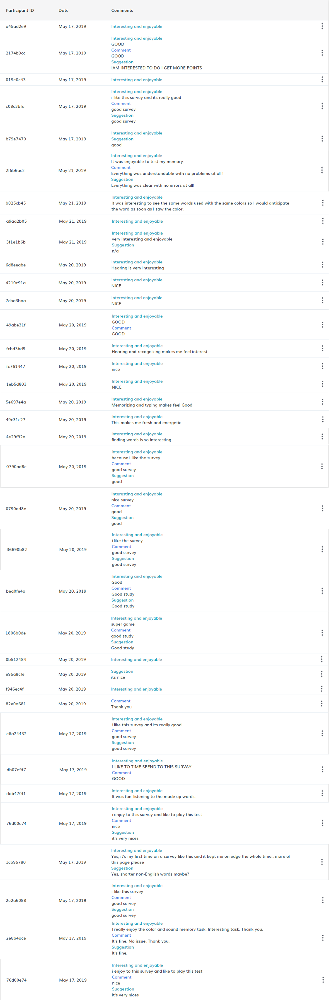

# Multi-page MTurk Experiments for Psychology Study

***Work supported by 12th [National Undergraduate Training Programs for Innovation and Entrepreneurship](http://gjcxcy.bjtu.edu.cn/)***

## Overview
### Origin
I developed this project for our psychological experiments, which involved repeatable behavior tests with various settings. Considering it's rather troublesome to find enough subjects (individuals), we decide to conduct the research using crowdsourcing.

In this process, I overcome some difficulties which I believe to be quite common, so I hereby release our project as a __best practice__.
### Core issues
1. The web-GUI client of Amazon Mechanical Turk (MTurk) only allows the creation of single-page HITs, but all our experiments contain multiple pages
2. One classical approach to _issue 1_ is to deploy a web app on your own server, but it requires time & (extra) money & skills
3. To pay the workers, designing interaction between your app and MTurk is a must, e.g., generating a _check code_ after each HIT and asking workers to fill it in a customized interface
### Solutions
1. We developed our web apps using [guidedtrack](https://guidedtrack.com)(easily creat questionnaire & track answers, repsonse time, etc), and deployed them using [github pages](https://pages.github.com)(free!)
2. To hack the template of original _guidedtrack_, we use customized css globally and locally (within the ```*html``` entries of corresponding _guidedtrack_ code)
3. [Positly](https://positly.com) has a native support for  _guidedtrack_(assignment & validation & payment), so we use it as our backend platform

## Demo
> As I have collected enough results, all experiments are disabled by default. If this case does occur, please **manually refresh the page once** to enable the demo

> VPN might be needed for China (mainland) users
- *Recognition* focused (2 attention levels × 4 setups)
  - High: [[1]](https://yidanliu-psy.github.io/MTurk/Recognition/High/1/) [[2]](https://yidanliu-psy.github.io/MTurk/Recognition/High/2/) [[3]](https://yidanliu-psy.github.io/MTurk/Recognition/High/3/) [[4]](https://yidanliu-psy.github.io/MTurk/Recognition/High/4/)
  - Low:  [[1]](https://yidanliu-psy.github.io/MTurk/Recognition/Low/1/) [[2]](https://yidanliu-psy.github.io/MTurk/Recognition/Low/2/) [[3]](https://yidanliu-psy.github.io/MTurk/Recognition/Low/3/) [[4]](https://yidanliu-psy.github.io/MTurk/Recognition/Low/4/)
- *Recall* focused (2 attention levels × 2 setups)
  - High: [[1]](https://yidanliu-psy.github.io/MTurk/Recall/High/1/) [[2]](https://yidanliu-psy.github.io/MTurk/Recall/High/2/)
  - Low: [[1]](https://yidanliu-psy.github.io/MTurk/Recall/Low/1/) [[2]](https://yidanliu-psy.github.io/MTurk/Recall/Low/2/)


## Project structure
- ```audio/```, ```color/```, and ```recognition```:  media file dependencies
- ```common/```: _guidedtrack_ code for various experimental settings
- ```docs/```: web apps
  - ```new.css```: our customized css file
  - ```other```: html pages & corresponding _guidedtrack_ code examples

## Feedback
We put the **user experience** of the crowdsourcing participants in the first place. Please read their feedbacks during our experiments:


